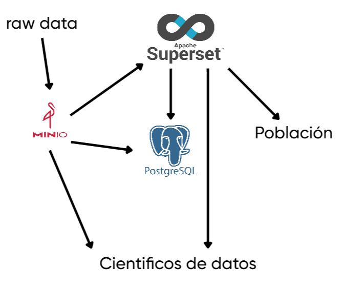
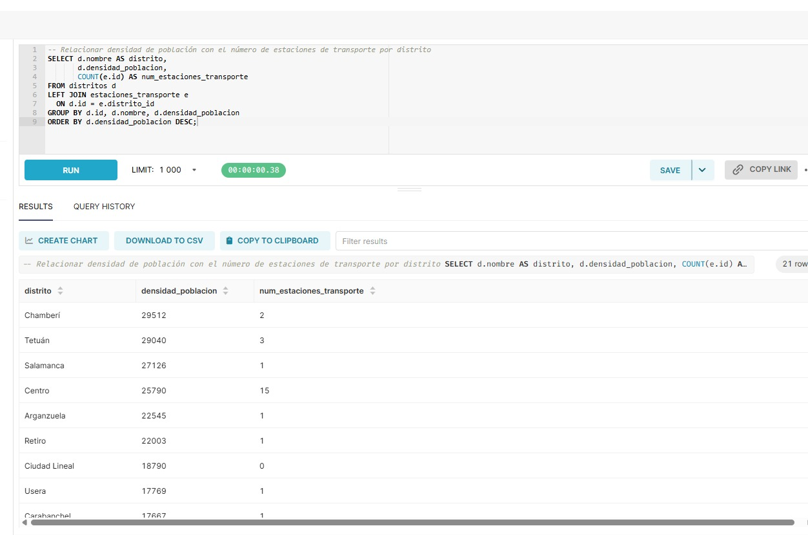
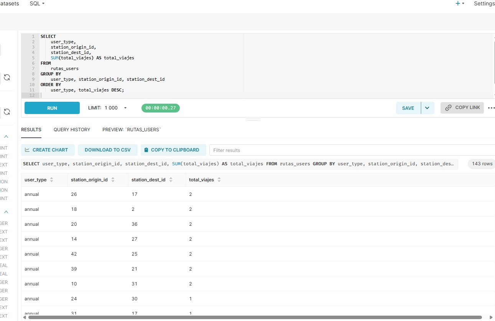
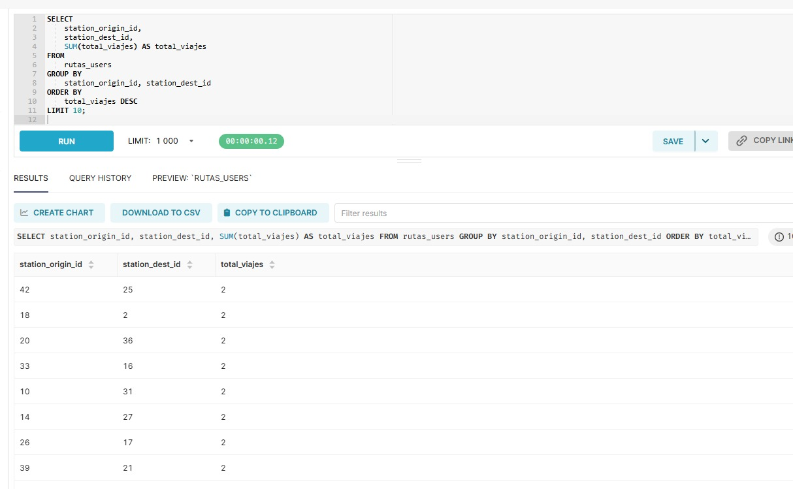
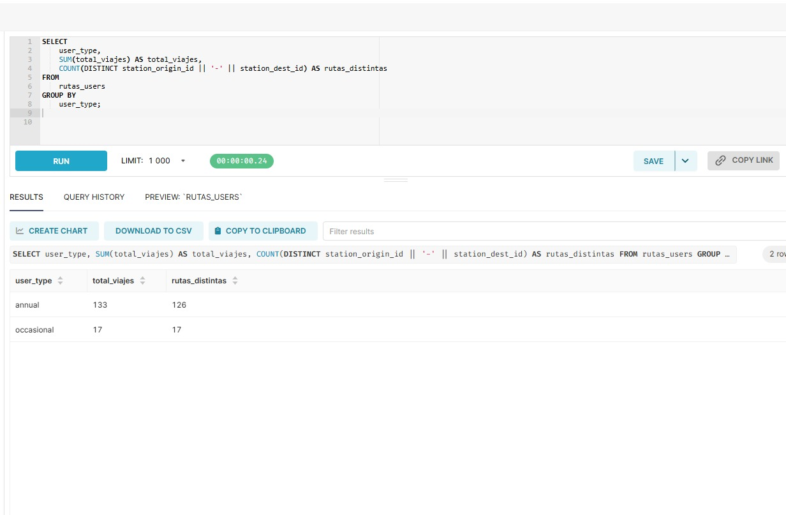
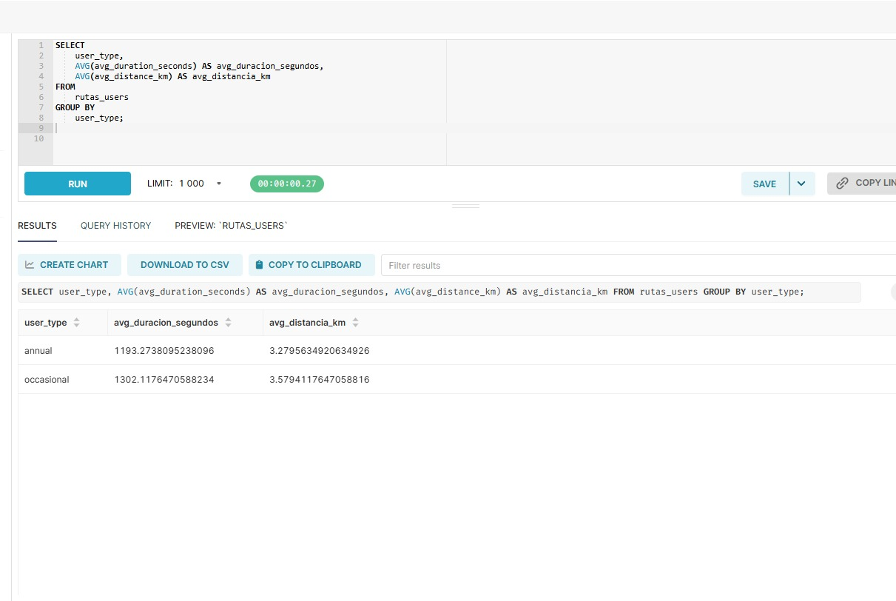
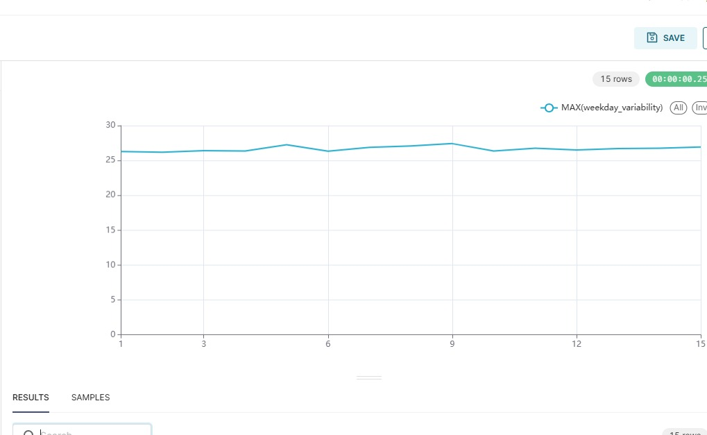
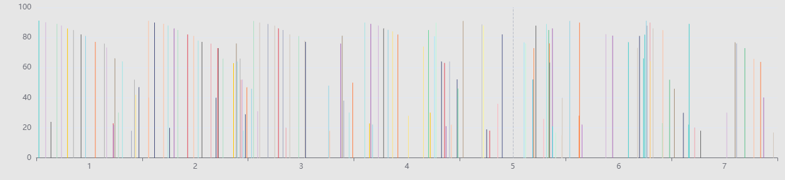
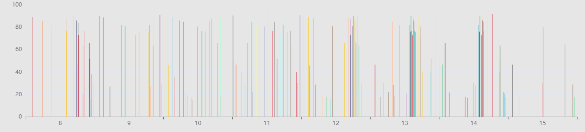

# Madrid Sostenible 2030 – Data Lake

Infraestructura de datos para la ciudad inteligente de Madrid, integrando MinIO, PostgreSQL y Apache Superset. Permite análisis avanzado, consultas SQL y visualización para perfiles técnicos y no técnicos.

---

## 1. Diagrama de la Infraestructura



**Componentes:**
- **MinIO**: Almacenamiento de objetos, con zonas `raw-ingestion-zone`, `process-zone`, `access-zone` y `govern-zone-metadata`.
- **PostgreSQL**: Base de datos relacional para modelo analítico y consultas SQL.
- **Superset**: Visualización y dashboards.
- **Python**: Scripts de ingestión, procesamiento y transformación.

---

## 2. Modelo de Datos Diseñado

**Fuentes integradas:**
- *Movilidad*: `trafico_horario.csv`, `bicimad_usos.csv`, `parkings_rotacion.csv`
- *Infraestructura*: `ext_aparcamientos_info.csv`
- *Participación ciudadana*: `avisamadrid.json`
- *Base municipal*: Dump SQL con información demográfica y de infraestructuras

**Tablas principales y datasets:**

| Tabla/Dataset         | Descripción                                         | Origen                              |
|----------------------|-----------------------------------------------------|-------------------------------------|
| rutas_users          | Rutas BiciMAD agregadas por usuario y tipo          | access-zone/rutas_users.parquet     |
| congestion_by_hour   | Congestión y vehículos predominantes por hora       | access-zone/congestion_by_hour.parquet |
| parkings_unidos      | Aparcamientos públicos con ubicación y ocupación    | access-zone/parkings_unidos.parquet |
| distritos            | Datos demográficos e infraestructuras por distrito  | dump-bbdd-municipal.sql             |
| avisos_ciudadanos    | Reportes ciudadanos de incidencias urbanas          | process-zone/avisa/avisos.parquet   |

**Ejemplo de esquema para `rutas_users`:**

| station_origin_id | station_dest_id | user_type   | total_viajes | avg_duration_seconds | avg_distance_km | total_users |
|------------------|----------------|------------|--------------|---------------------|-----------------|-------------|
| 1                | 20             | occasional | 1            | 919.0               | 2.53            | 1           |
| 1                | 25             | annual     | 1            | 1038.0              | 2.85            | 1           |

---

## 3. Procesos de Transformación Implementados

- **Ingesta:**  
  - Scripts Python (`ingest_data.py`) cargan los datos originales a MinIO en `raw-ingestion-zone`.
- **Procesamiento y estandarización:**  
  - Limpieza y enriquecimiento de datos (`process_data.py`): normalización de columnas, tipos, fechas, derivación de campos temporales, validación de calidad.
  - Resultados almacenados en MinIO `process-zone` en formato Parquet.
- **Transformación avanzada y agregación:**  
  - Generación de datasets analíticos listos para BI (`access_data.py`):  
    - Resúmenes horarios de congestión de tráfico  
    - Popularidad de rutas BiciMAD  
    - Unificación de datos de aparcamientos
- **Carga a modelos analíticos:**  
  - Los datasets finales se cargan a la zona `access-zone` de MinIO y a PostgreSQL.
- **Gobernanza y trazabilidad:**  
  - Metadata y logs de transformaciones en `govern-zone-metadata`.

---

## 4. Guía de Puesta en Marcha

**Requisitos previos:**
- Docker y Docker Compose instalados
- Puertos libres: 9000 (MinIO), 5432 (PostgreSQL), 8088 (Superset)

**Pasos:**

1. **Clonar el repositorio y preparar datos:**
```
git clone git@github.com:adrianfuertes04/practica2ibd.git
cd practica2ibd
```

2. **Levantar la infraestructura:**
docker-compose up -d

Esto inicia MinIO, PostgreSQL, Superset y crea los buckets necesarios en MinIO.

3. **Ingestar y procesar datos:**
- Ejecutar scripts de ingestión:
  ```
  docker exec -it python-client python /scripts/ingest_data.py
  ```
- Ejecutar procesamiento y transformación:
  ```
  docker exec -it python-client python /scripts/process_data.py
  docker exec -it python-client python /scripts/access_data.py
  ```
- Ejecutar el archivo *dimensional_bbdd.py*

- Aunque tenemos el dockerfile que se instale psycopg2, tiene que haber algún problema y se necesita instalarlo desde dentro, por lo que hay que ejecutar:
  ```
  docker exec -it superset bash
  ```
  y dentro:
  ```
  pip install psycopg2-binary
  ```
  Con la librería instalada volvemos a ejecutar el *dimensional_bbdd.py* para que funcione
  

4. **Acceder a los servicios:**

| Servicio   | URL                     | Usuario    | Contraseña  |
|------------|-------------------------|------------|-------------|
| MinIO      | http://localhost:9001   | minioadmin | minioadmin  |
| Superset   | http://localhost:8088   | admin      | admin123    |

5. **Configurar Superset:**
- Entrar en Superset y conectar la base de datos PostgreSQL.
- Ejecutar las consultas SQL necesarias.
- Crear dashboards a partir de las tablas/datasets analíticos.

---

## 5. Ejemplos de Uso y Soporte a las Consultas

**a) Científicos de datos (Python/Notebooks):**
El archivo obj1.ipynb en la carpeta objetivos muestra como los científicos de datos, empresas y organizaciones pueden hacer a los archivos de la access-zone y procesar los datos según necesiten.


**b) Gestores municipales (SQL/Superset):**
Los gestores municipales pueden conectarse a la base de datos creada y hacer las consultas que necesiten. En las siguientes capturas se ve el buen funcionamiento:

Relacionar densidad de población con infraestructua transporte:


Rutas de BiciMAD más populares y variación uso entre usuarios abonados y ocasionales:






**c) Ciudadanos y asociaciones (Superset):**
Hemos diseñado algunos gráficos:
- Weekly variability:
  

- Ocupación por horas y parking:
  
  
  
